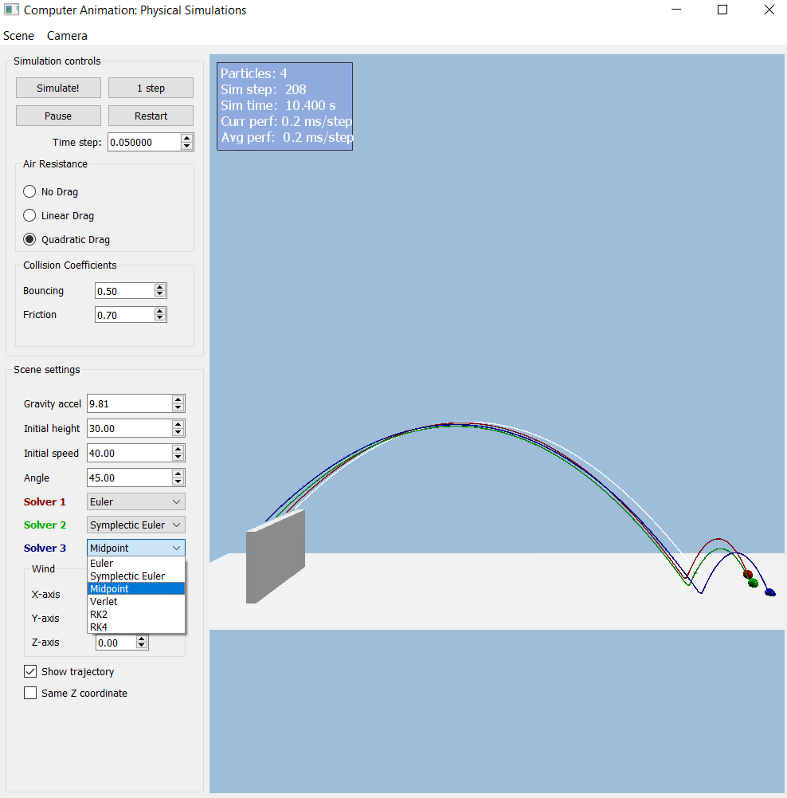

# computer-animation-simulation

## Lab 1: Particle Systems
I have chosen the Midpoint Integrator since it has more appealing results when activating the blackhole gravitational attraction force with the lowest computation (RK2 and RK4 also give appealing results).

### Particle systems with 1000s of particles DONE
Tested with 2000 particles smoothly in release mode

### Collisions: test & response DONE
- Plane
- AABB
- Sphere

### Gravity + another force DONE
- Gravity
- Linear Drag Force
- Quadratic Drag Force
- Gravitational attraction (Blackhole)

### Mouse interaction DONE
By selecting the object in the UI, we can move it by dragging the mouse and pressing the right-click

### Bonus: Spatial Hash Table DONE

---

## Lab 0: Warm Up

### Integrators DONE
The integrator solvers can be chosen from the comboBox next to each SolverN at the UI and pressing restart.

- Symplectic Euler
- Midpoint
- Verlet
- RK2
- RK4

### Forces DONE
Wind force can be set in the UI as accelerations in each X,Y,Z axis. As for the air resistance, you can choose between no drag, linear drag, and quadratic drag.

- Wind as constant acceleration force
- Linear Drag
- Quadratic Drag

### SceneProjectiles DONE

- Added an additional particle for more testing
- Simple collision to plane with condition y<=0
- Added bouncing and friction coefficients editable in UI
