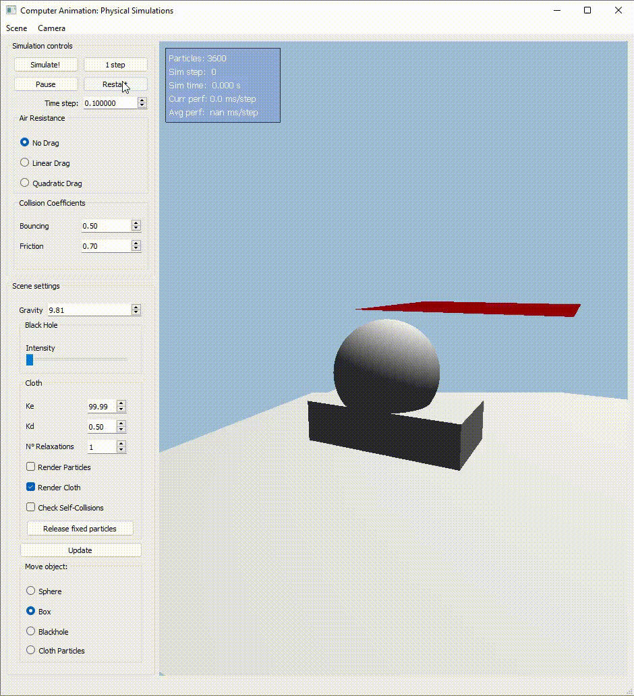
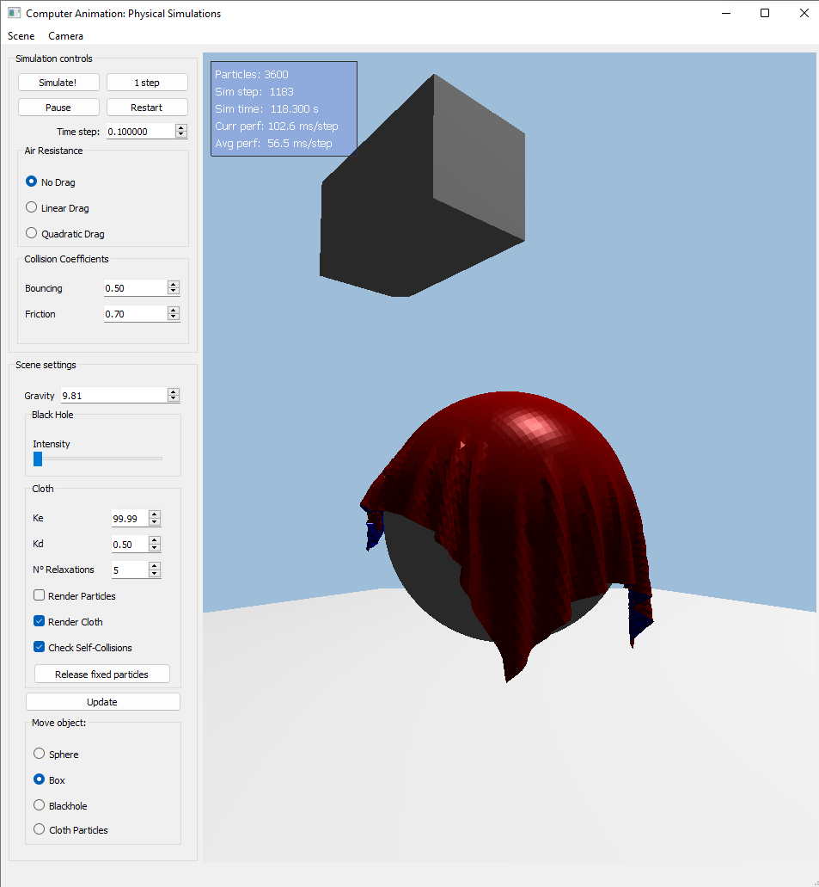
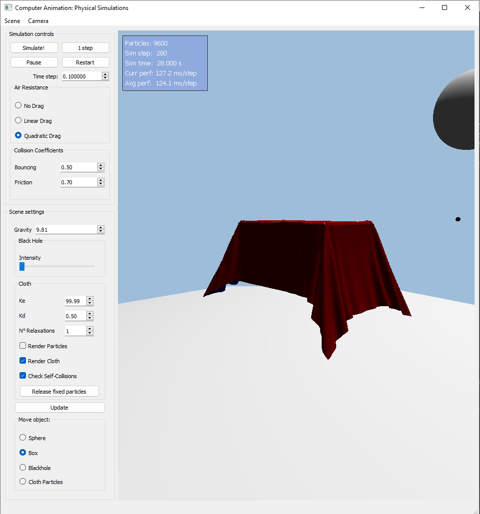
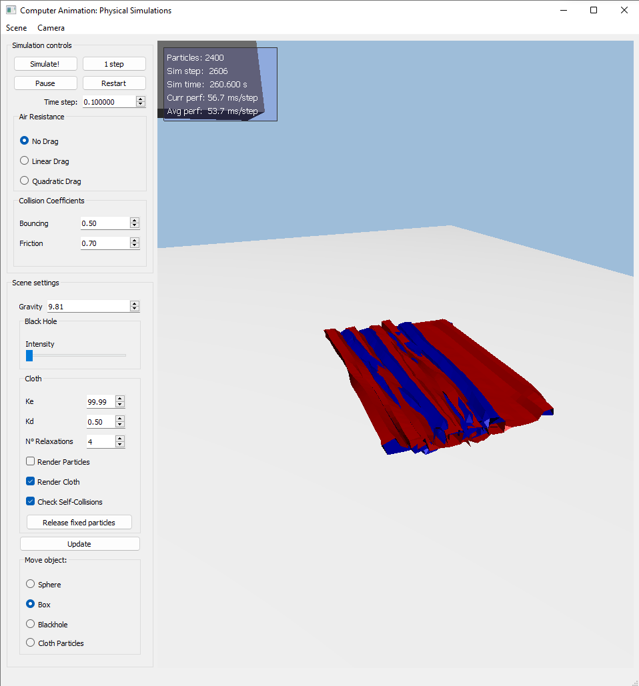
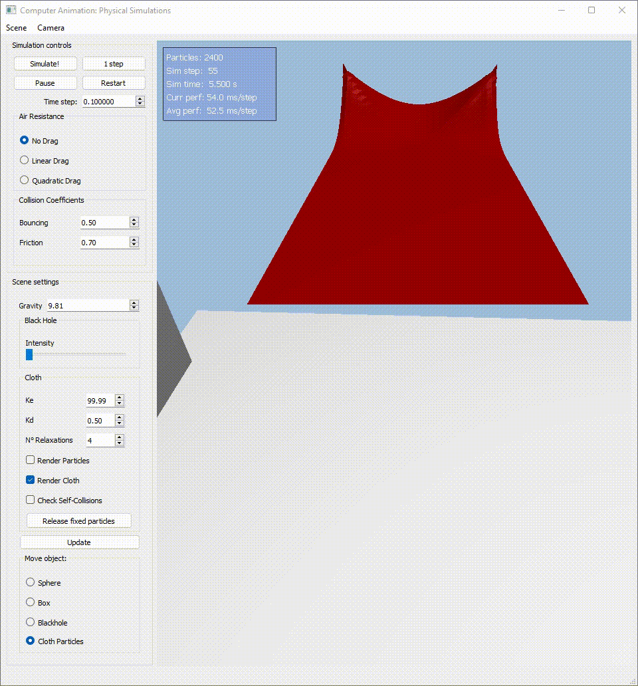
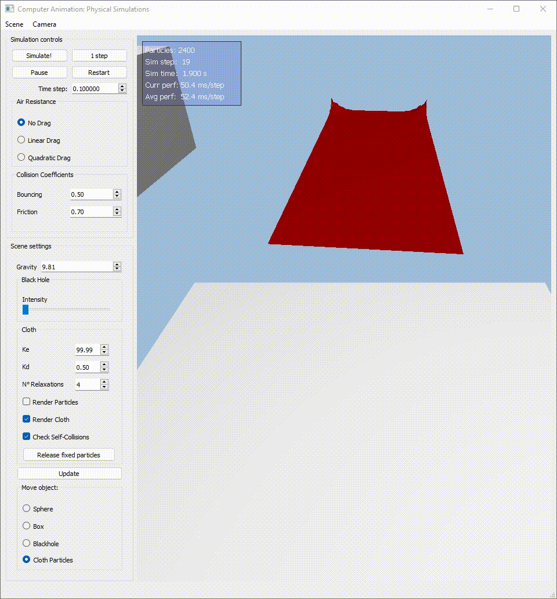
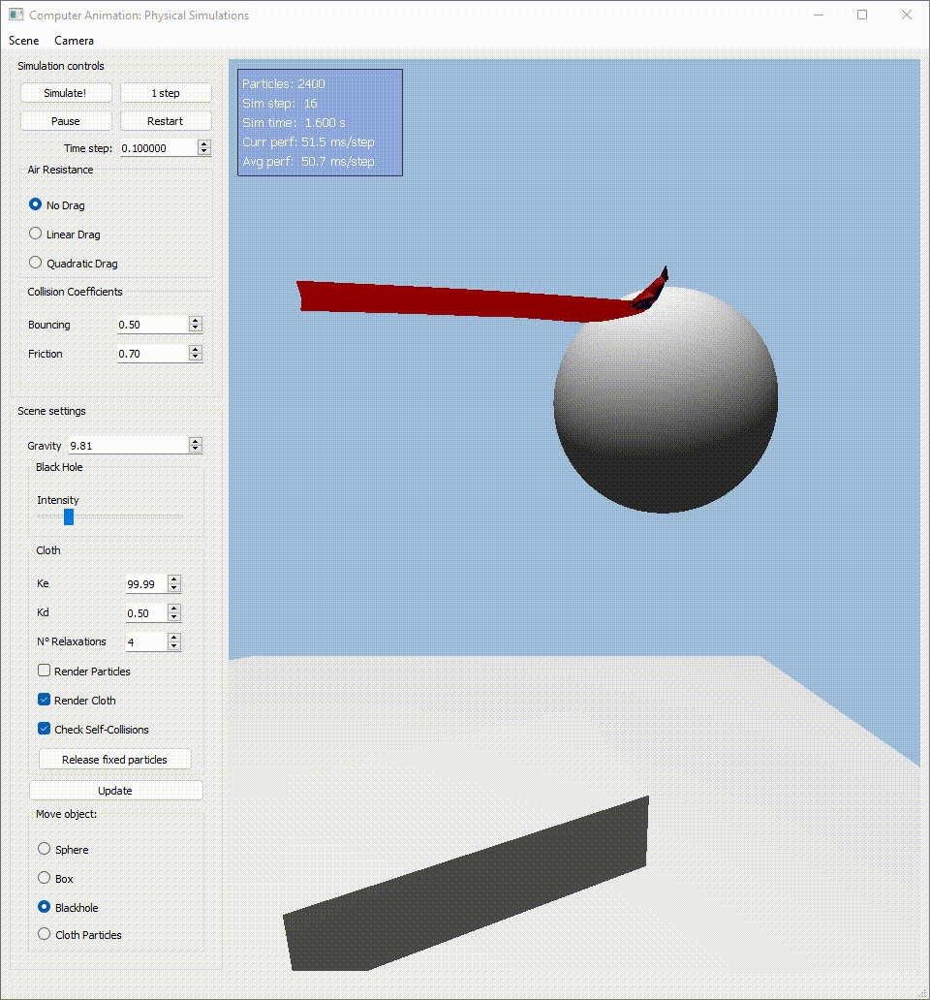
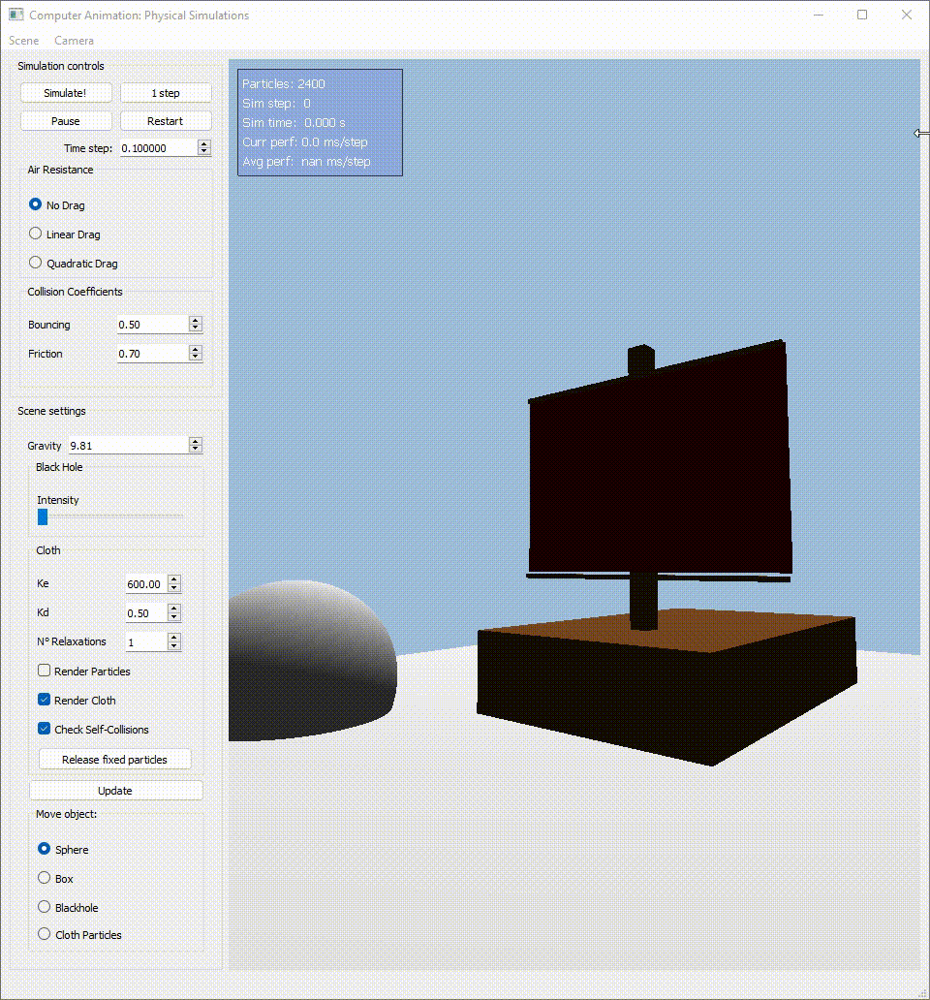
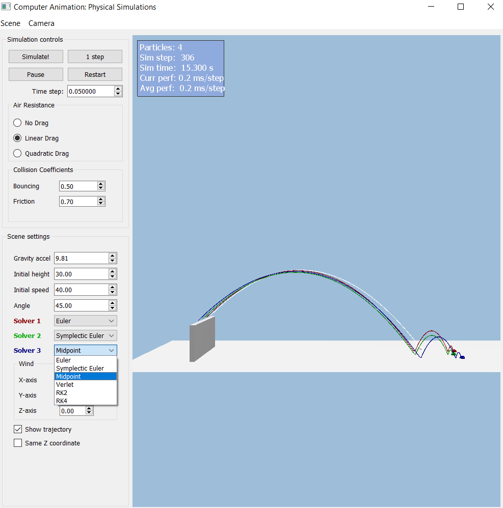

# computer-animation-simulation

## Lab 2: Cloth Simulation

### Collisions

#### Particle-collider DONE

##### Sphere Collision

##### Box Collision

#### Prevent self-intersections

##### Use Particles & Particle Hash DONE
Adjusted the Particle Spatial Hash from Lab1

##### Consider Rest Distance and avoid Jittering DONE
Set a minimum distance between the Rest Distance and collision distance

##### Use Substepping, not CCD DONE
Set substepping=10 for the integrator step and collision detection

##### Stable Cloth-Cloth Friction DONE

### Integrator Used
Better results with Verlet, but other integrators work as well.

### Interactions

#### Grab and move particles DONE
Taking advantage of the spatial hash, perform a ray-particle collision detection.

#### Fix/Release particles DONE

#### Blackhole DONE

#### Boat Scene :o
Verlet Integrator is not working well for the fountain, so had to try others like RK2 to avoid using custom integrators for cloths and other for fountain particles.

### Issues

#### Self-intersection not looking properly
Even adding the recommended steps to achieve self-intersection, it still looks flat, and by increasing the thickness, the cloth starts to become unstable.

#### Cloth Simulation exploded easily
Starting with Symplectic Euler, increasing the kElastic to +400.0 helps with stability, then implementing relaxation steps, and finally moving to Verlet integrator which is Physically Based Dyanmics (more stable!).

#### Sphere not colliding when moved
Had to adjust a bit the formula for Verlet by updating the prevPos with the velocity added because of the collision.

---

## Lab 1: Particle Systems
I have chosen the Midpoint Integrator since it has more appealing results when activating the blackhole gravitational attraction force with the lowest computation (RK2 and RK4 also give appealing results).

### Particle systems with 1000s of particles DONE
Tested with 2000 particles smoothly in release mode

### Collisions: test & response DONE
- Plane
- AABB
- Sphere

### Gravity + another force DONE
- Gravity
- Linear Drag Force
- Quadratic Drag Force
- Gravitational attraction (Blackhole)

### Mouse interaction DONE
By selecting the object in the UI, we can move it by dragging the mouse and pressing the right-click

### Bonus: Spatial Hash Table DONE
### Bonus: Snowball Scene DONE

---

## Lab 0: Warm Up

### Integrators DONE
The integrator solvers can be chosen from the comboBox next to each SolverN at the UI and pressing restart.

- Symplectic Euler
- Midpoint
- Verlet
- RK2
- RK4

### Forces DONE
Wind force can be set in the UI as accelerations in each X,Y,Z axis. As for the air resistance, you can choose between no drag, linear drag, and quadratic drag.

- Wind as constant acceleration force
- Linear Drag
- Quadratic Drag

### SceneProjectiles DONE

- Added an additional particle for more testing
- Simple collision to plane with condition y<=0
- Added bouncing and friction coefficients editable in UI
